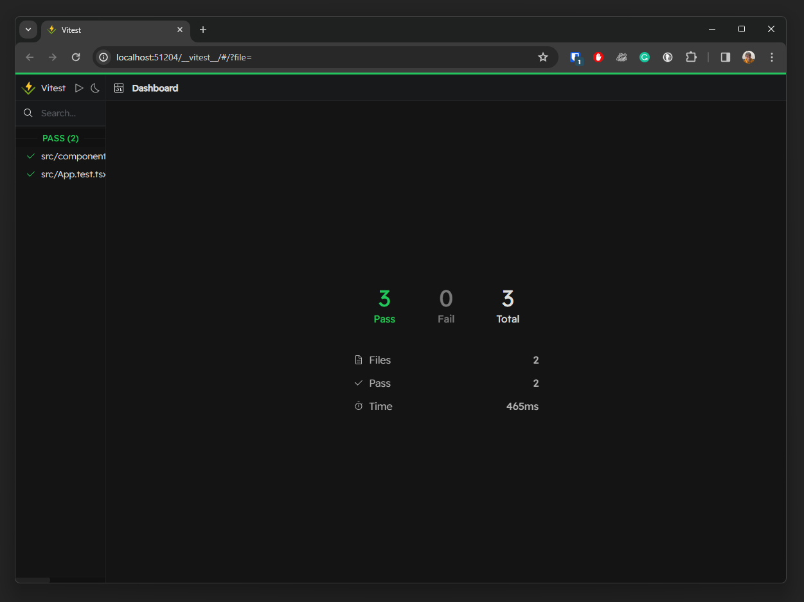
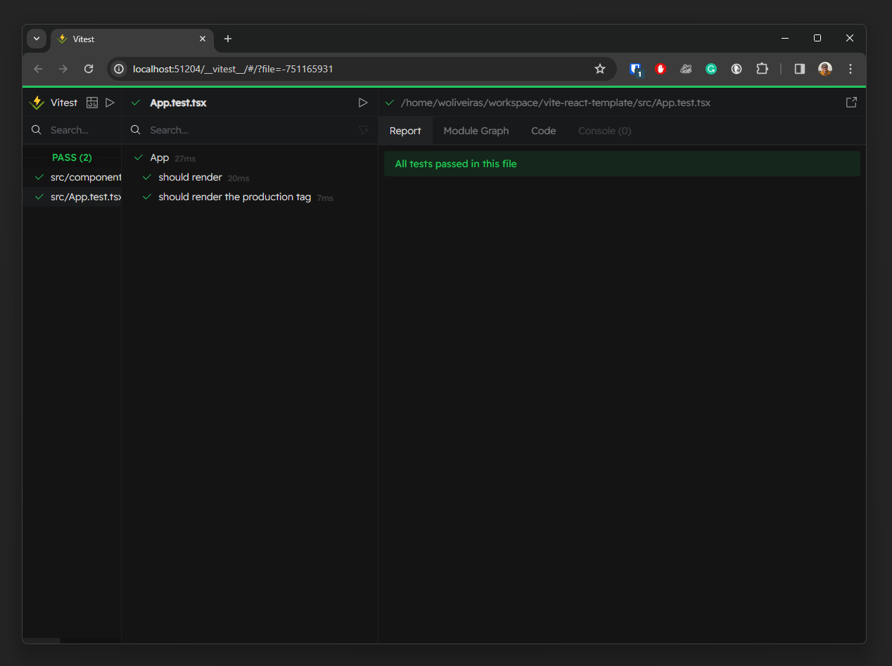
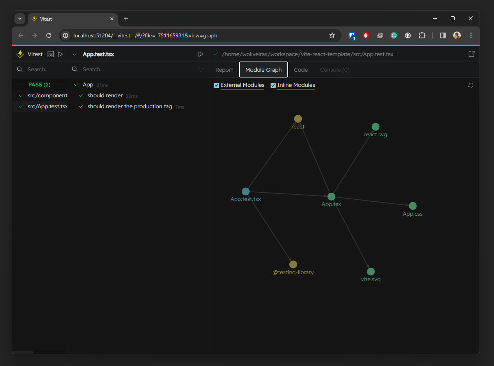

# json-server-template

Vitejs and React starting template using Git Hooks, Vitest, and Vitest UI, react-testing-library and json-server.

## <a name='ReactVitejson-server'></a>React, Vite + json-server

This template provides a minimal setup to get React working in Vite with HMR and some ESLint rules using the json-server as mock server to work with XHR.

Based on [woliveiras/vite-react-template](https://github.com/woliveiras/vite-react-template).

Maybe you will need help to create some GitHub Actions or another .github configuration. So, you can check my other template for it: [woliveiras/.github](https://github.com/woliveiras/.github)

---

**Table of Contents**

<!-- vscode-markdown-toc -->

- [React, Vite + json-server](#ReactVitejson-server)
- [How to use this template](#Howtousethistemplate)
- [How to run this project](#Howtorunthisproject)
- [Available Endpoints](#AvailableEndpoints)
- [Running the tests](#Runningthetests)
- [Watching tests in UI mode](#WatchingtestsinUImode)

<!-- vscode-markdown-toc-config
	numbering=false
	autoSave=true
	/vscode-markdown-toc-config -->
<!-- /vscode-markdown-toc -->

## <a name='Howtousethistemplate'></a>How to use this template

You just need to click on the button `Use this template` close to the reppo stars (remember to give me a star to make me happy) and start a new repo or open it in code space.

**It would be good if you knew this before starting**

We are using:

- [Husky](https://typicode.github.io/husky/) to run the Git Hooks;
- [NVM](https://github.com/nvm-sh/nvm) to handle the Node versions;

You can update environment variables in the files:

- [.env](./.env): the base env vile, the variables here will be used in all environments
- [.env.development](./.env): the development mode, just read in your local environment (npm run dev)
- [.env.production](./.env): the production mode, will be read in your production environment (npm run build)

And you can create new variables with the prefix `VITE_`.

Example: `VITE_EXAMPLE_VAR`.

In the [App.tsx](./src/App.tsx) you can see the use of `import.meta.env` to import env variables.

## <a name='Howtorunthisproject'></a>How to run this project

First of all, let's configure our enviroment.

You will need NVM installed on your environment. So, get the latest version here: [nvm-sh/nvm](https://github.com/nvm-sh/nvm)

Install the `.nvmrc` Node version with the following command:

```sh
nvm install
```

After that, you can use it with:

```sh
nvm use
```

Now, we can install the application dependencies and start our dev-server with the commands below:

```sh
npm i
npm run dev
```

Seed the DB with the following command:

```sh
npm run seed-db
```

Run the server:

```sh
npm run server
```

## <a name='AvailableEndpoints'></a>Available Endpoints

You can use the mock server with the endpoints:

`GET all`: http://localhost:4002/companies/
`GET one`: http://localhost:4002/companies/<Company_ID>
`GET specific`: http://localhost:4002/companies?company=Doylly

`POST with body params`: http://localhost:4002/companies/
`POST with URL params`: http://localhost:4002/companies?id=0101010&company=Test

`PATCH with body params`: http://localhost:4002/companies/
`PATCH with URL params`: http://localhost:4002/companies?id=0101010&company=Test

`DELETE one`: http://localhost:4002/companies/<Company_ID>

## <a name='Runningthetests'></a>Running the tests

Running all tests:

```sh
npm t
```

Watching all tests:

```sh
npm run test:watch
```

To watch one file, you just need to add the path in the watch command:

```sh
npm run test:watch src/components/Example/Example.test.tsx
```

To run the coverage, you just need this command:

```sh
npm run coverage
```

## <a name='WatchingtestsinUImode'></a>Watching tests in UI mode

If you don't know, we can use a UI to run our tests and check dependency graph like the following screenshots.

You just need to run the command:

```sh
npm run test:ui
```

| Screenshots                                                        |
| ------------------------------------------------------------------ |
|      |
|     |
|  |
